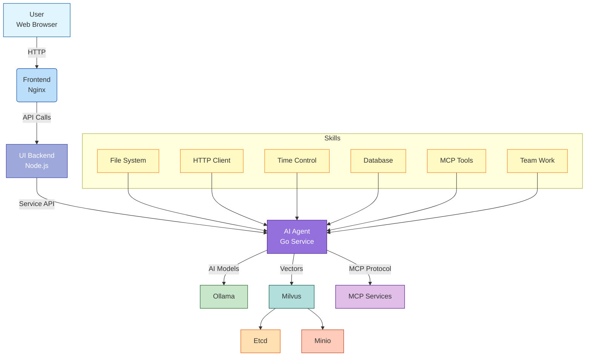

```mermaid
graph TB
    A[User<br/>Web Browser] -->|HTTP| B(Frontend<br/>Nginx)
    B -->|API Calls| C[UI Backend<br/>Node.js]
    C -->|Service API| D[AI Agent<br/>Go Service]
    
    D -->|AI Models| E[Ollama]
    D -->|Vectors| F[Milvus]
    D -->|MCP Protocol| G[MCP Services]
    
    F --> H[Etcd]
    F --> I[Minio]
    
    subgraph Skills
        K[File System]
        L[HTTP Client]
        M[Time Control]
        N[Database]
        O[MCP Tools]
        P[Team Work]
    end
    
    K --> D
    L --> D
    M --> D
    N --> D
    O --> D
    P --> D
    
    style A fill:#e1f5fe,stroke:#01579b
    style B fill:#bbdefb,stroke:#0d47a1
    style C fill:#9fa8da,stroke:#303f9f,color:#fff
    style D fill:#9370db,stroke:#4a148c,color:#fff
    style E fill:#c8e6c9,stroke:#1b5e20
    style F fill:#b2dfdb,stroke:#004d40
    style G fill:#e1bee7,stroke:#4a148c
    style H fill:#ffe0b2,stroke:#e65100
    style I fill:#ffccbc,stroke:#bf360c
    style K fill:#fff9c4,stroke:#f57f17
    style L fill:#fff9c4,stroke:#f57f17
    style M fill:#fff9c4,stroke:#f57f17
    style N fill:#fff9c4,stroke:#f57f17
    style O fill:#fff9c4,stroke:#f57f17
    style P fill:#fff9c4,stroke:#f57f17
```