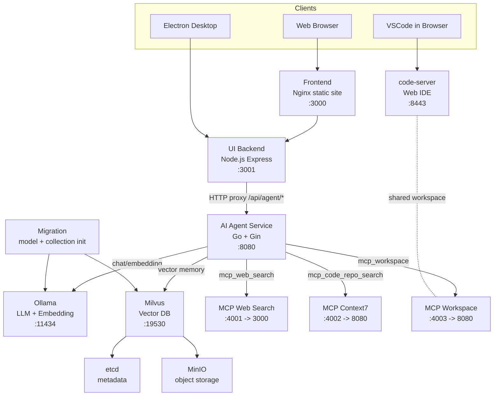

# AI Agent Architecture

## 1. Runtime Topology

## 2. Service Responsibilities

### frontend (Nginx)
- Serves static web UI from `frontend/`.
- Forwards user interactions to `ui-backend` through browser API calls.

### ui-backend (Node.js / Express)
- Exposes stable client-facing API: `/api/agent/*`.
- Proxies requests to `ai-agent-svc` and handles stream passthrough for SSE chat.
- Provides health endpoint: `/health`.

### ai-agent-svc (Go / Gin)
- Hosts the core AI agent runtime.
- Registers skill set and orchestrates tool invocation.
- Connects to Ollama, Milvus, and MCP services.
- Exposes endpoints: `/health`, `/status`, `/chat`, `/skill`, `/config`, `/memory`.

### data and model infrastructure
- **Ollama**: language model inference and embeddings.
- **Milvus**: vector storage/search for memory retrieval.
- **etcd + MinIO**: Milvus dependencies for metadata and object storage.

### MCP services
- **mcp-web-search**: external web search tool endpoint.
- **mcp-context7**: code/documentation retrieval tool endpoint.
- **mcp-workspace-server**: workspace file operation endpoint for agent code output.

### development helper services
- **migration**: initializes model dependencies and vector collection before `ai-agent-svc` starts.
- **code-server**: browser-accessible VSCode bound to workspace files used by MCP workspace operations.

## 3. Request Flow

### Chat flow (non-stream)
1. Client sends `POST /api/agent/chat` to `ui-backend`.
2. `ui-backend` forwards to `POST /chat` in `ai-agent-svc`.
3. `ai-agent-svc` runs agent loop, optionally invokes skills/tools.
4. Response returns via `ui-backend` to client.

### Chat flow (stream/SSE)
1. Client sends `POST /api/agent/chat` with `stream: true`.
2. `ui-backend` opens SSE response and proxies streamed chunks from `ai-agent-svc`.
3. `ai-agent-svc` emits `message`, `error`, `complete` SSE events.

### Skill flow
1. Client sends `POST /api/agent/skill` with `skillName` + `parameters`.
2. `ui-backend` proxies request to `ai-agent-svc`.
3. `ai-agent-svc` executes registered skill and returns result.

## 4. Registered Skills (Default Runtime)

`ai-agent-svc/main.go` currently registers:
- `file_reader`
- `file_writer`
- `file_remover`
- `directory_reader`
- `directory_writer`
- `directory_remover`
- `mcp_web_search`
- `mcp_code_repo_search`
- `mcp_workspace` (enabled when `MCP_WORKSPACE_HOST` is configured)
- `sleep`

## 5. Deployment Modes

- **Full local stack**: `docker compose up --build -d`
- **Service-only development**:
  - `ui-backend` locally (`npm run dev`)
  - `ai-agent-svc` locally (`go run main.go`)
  - infrastructure via compose as needed

## 6. Testing and CI Architecture

- Unit tests:
  - Go: `go test ./...`
  - UI backend: `npm test`
  - Desktop client: `npm test`
- Integration/UI:
  - `docker-compose.api-test.yml`
  - `docker-compose.ui-test.yml`
  - `docker-compose.desktop-test.yml`
- CI workflow: `.github/workflows/ci.yml` (`CI Tests`).
